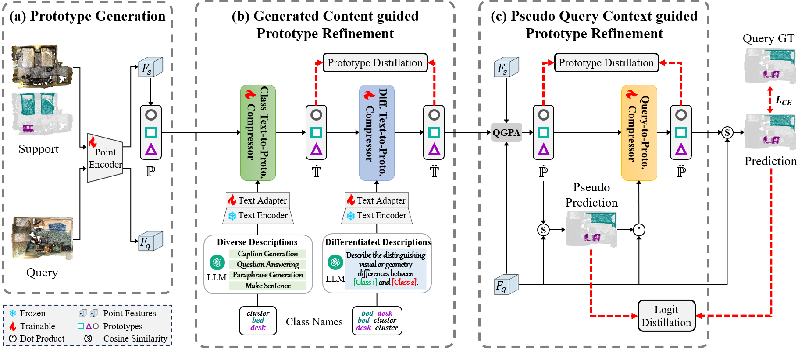

# Generated and Pseudo Content guided Prototype Refinement for Few-shot Point Cloud Segmentation [[pdf](https://proceedings.neurips.cc/paper_files/paper/2024/file/377d0752059d3d4686aa021b664a25dd-Paper-Conference.pdf)]


## Overview




## Code 

**Code will coming soon!**

## Running 

**Installation and data preparation please follow [attMPTI](https://github.com/Na-Z/attMPTI).**


### Training

Pretrain the segmentor which includes feature extractor module on the available training set:

```bash
bash scripts/pretrain_segmentor.sh
```

Train our method under few-shot setting:

```bash
bash scripts/train_GPCPR.sh
```

### Evaluation

Test our method under few-shot setting:

```bash
bash scripts/eval_GPCPR.sh
```

## Citation
Please cite our paper if it is helpful to your research:

    @inproceedings{NEURIPS2024_377d0752,
     author = {Wei, Lili and Lang, Congyan and Chen, Ziyi and Wang, Tao and Li, Yidong and Liu, Jun},
     booktitle = {Advances in Neural Information Processing Systems},
     editor = {A. Globerson and L. Mackey and D. Belgrave and A. Fan and U. Paquet and J. Tomczak and C. Zhang},
     pages = {31103--31123},
     publisher = {Curran Associates, Inc.},
     title = {Generated and Pseudo Content guided Prototype Refinement for Few-shot Point Cloud Segmentation},
     url = {https://proceedings.neurips.cc/paper_files/paper/2024/file/377d0752059d3d4686aa021b664a25dd-Paper-Conference.pdf},
     volume = {37},
     year = {2024}
    }


## Acknowledgement
We thank [DGCNN (pytorch)](https://github.com/WangYueFt/dgcnn/tree/master/pytorch), [attMPTI](https://github.com/Na-Z/attMPTI), [QGPA](https://github.com/heshuting555/PAP-FZS3D), and [PointCLIP](https://github.com/ZrrSkywalker/PointCLIP) for sharing their source code.
